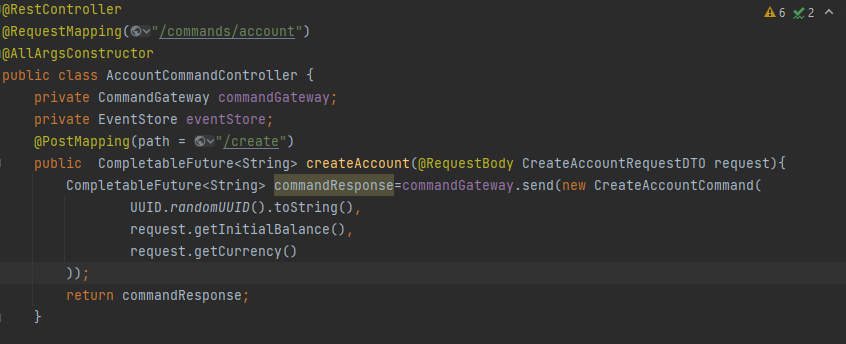
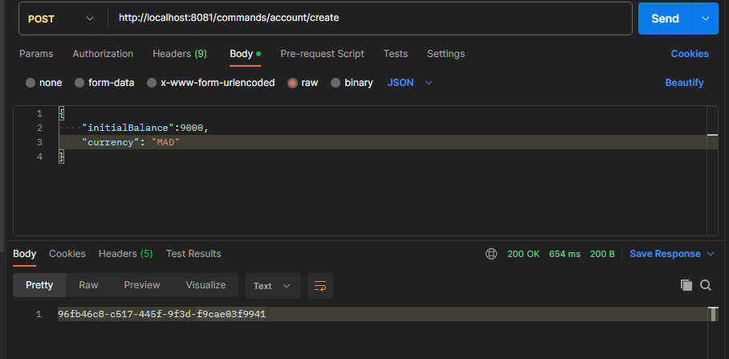
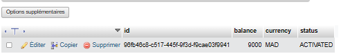
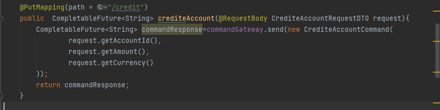
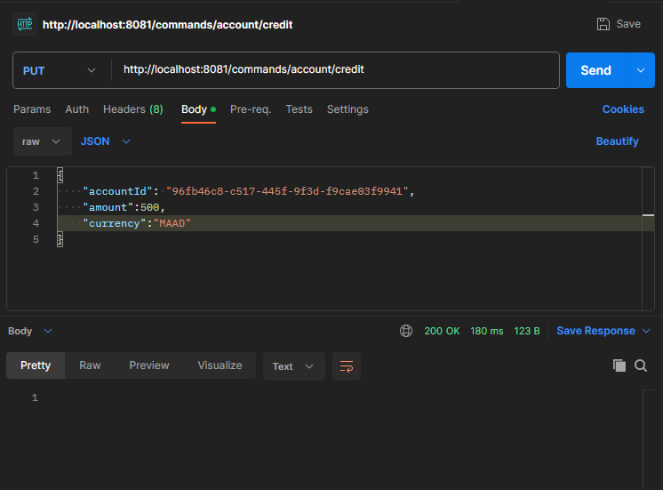
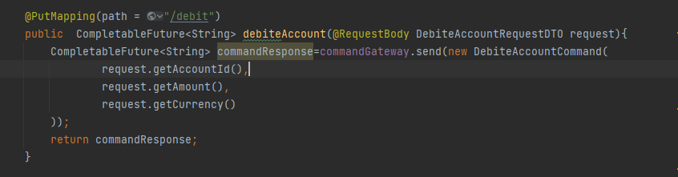
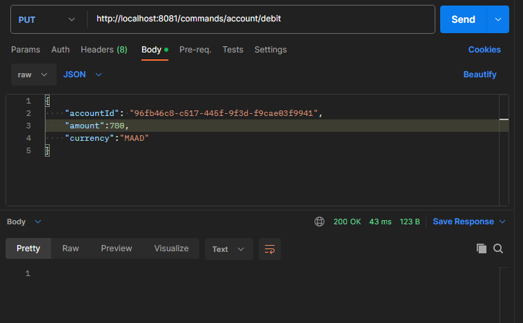
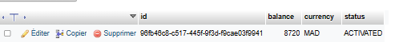
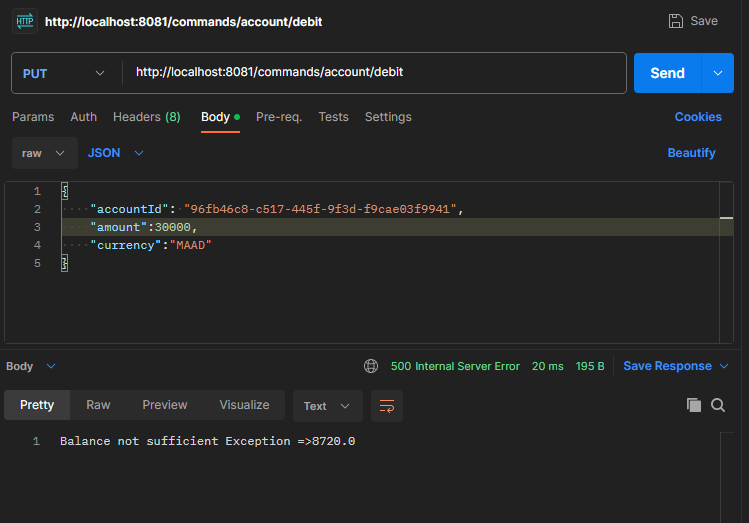

Activité Pratique N°3 - Event Driven Architecture

Créer une application qui permet de gérer des comptes respectant les patterns 
CQRS et Event Sourcing avec les Framework AXON et Spring Boot :

Création du Compte :

Test Création du compte :

Virement : 

Test : 

Débit :

Test :

